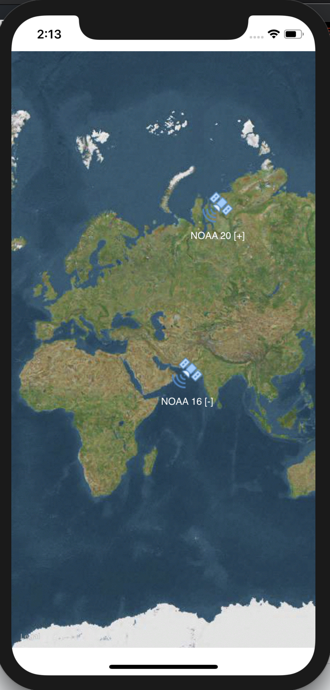

Work in progress...

# TheiaSat - Satellite Tracking App

Recently, I've been really interested in picking up satellite transmissions with my SDR setup. My main problem is that I don't have a good app that can show me positions and AOS/LOS of satellites for the objects I want to track. This is my attempt at making the app that that I need and hopefully it can be some use to others.

**This is in early development, please have patience as I am currently prototyping.**

**See License and Notice for more information.**

## Todo
- [ ] Choose satellites to track.
- [ ] Only update TLE data once a day, if possible.
- [ ] Setup user notifications when satellite is within a certain period of AOS.
- [ ] Create satellite details page including polar coordinates relative to user's location, transponder frequencies, etc.
- [ ] Show future pass tracks as overlay.
- [ ] Show satellite AOS / LOS circle.
- [ ] Send polar coordinate data over bluetooth to aid in directional antenna tracking.
- [ ] Maaaaybe ARKit view of position of satellite in sky.
- [ ] Add different map templates.
- [ ] "Dark Mode" to maintain night vision for seeing bright satellites visually.

## Resources

### TLE / Keplerian Elements Data
http://celestrak.com/publications/AIAA/2006-6753/AIAA-2006-6753.pdf
https://spaceflight.nasa.gov/realdata/sightings/SSapplications/Post/JavaSSOP/SSOP_Help/tle_def.html
https://www.amsat.org/keplerian-elements-resources/
https://api.nasa.gov/api.html#trek
https://celestrak.com